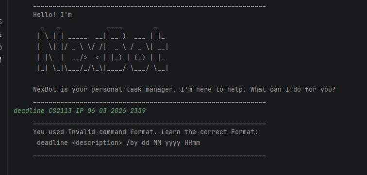

# NexBot

NexBot is a command-line task management application written in Java. It helps users manage ToDo, Deadline, and Event tasks efficiently through a text-based interface.



## Quick Start

1. Ensure you have Java 17 installed on your computer.
1. Download the latest .jar file from `Releases`.
1. As the program creates save files in the same folder, you are recommended to create a separate directory for NexBot.
1. Run the program using the command `java -jar <release-name>.jar`

## Setting up in Intellij

Prerequisites: JDK 17, update Intellij to the most recent version.

1. Open Intellij (if you are not in the welcome screen, click `File` > `Close Project` to close the existing project first)
1. Open the project into Intellij as follows:
    1. Click `Open`.
    1. Select the project directory, and click `OK`.
    1. If there are any further prompts, accept the defaults.
1. Configure the project to use **JDK 17** (not other versions) as explained in [here](https://www.jetbrains.com/help/idea/sdk.html#set-up-jdk).<br>
   In the same dialog, set the **Project language level** field to the `SDK default` option.
    1. After that, locate the `src/main/java/nexbot/ui/NexBot.java` file, right-click it, and choose `Run nexbot.ui.NexBot.main()` (if the code editor is showing compile errors, try restarting the IDE). If the setup is correct, you should see something like the below as the output:
       ```
       Hello from
       _   _            ____        _   
       | \ | | _____  __| __ )  ___ | |_
       |  \| |/ _ \ \/ /|  _ \ / _ \| __|
       | |\  |  __/>  < | |_) | (_) | |_
       |_| \_|\___/_/\_\|____/ \___/ \__|
       ```

**Warning:** Keep the `src\main\java` folder as the root folder for Java files (i.e., don't rename those folders or move Java files to another folder outside of this folder path), as this is the default location some tools (e.g., Gradle) expect to find Java files.


## Commands

1. `todo <description>` — Add a todo task
2. `deadline <description> /by <dd MM yyyy HHmm>` — Add a deadline task
3. `event <description> /from <dd MM yyyy HHmm> /to <dd MM yyyy HHmm>` — Add an event task
4. `list` — List all tasks
5. `mark <task number>` — Mark task as done
6. `unmark <task number>` — Unmark task
7. `delete <task number>` — Delete a task
8. `filter <dd MM yyyy>` — Filter by date
9. `find <keyword>` — Find by keyword
10. `bye` — Exit NexBot